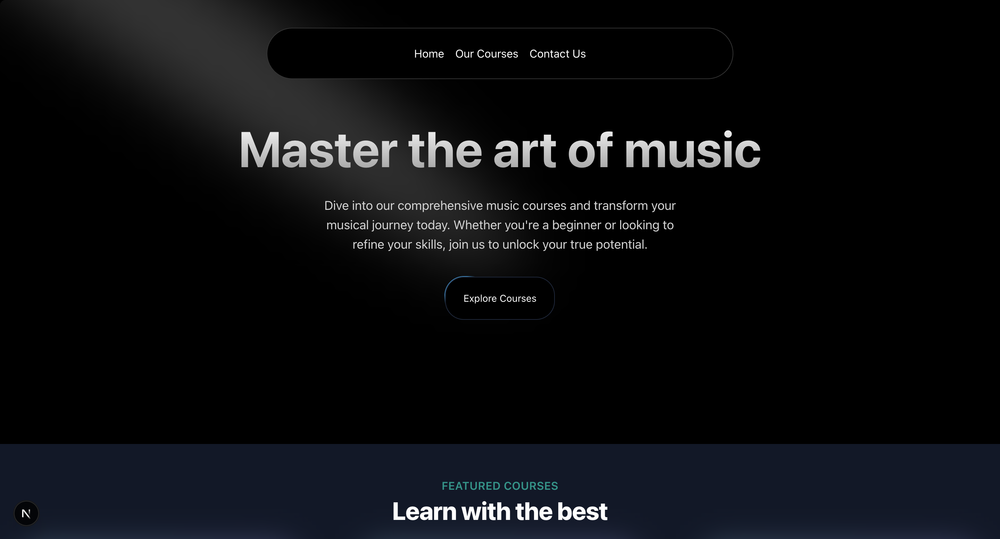

# 🎵 MusicApp - Next.js Learning Platform

> 🚀 A modern, elegant, and lightning-fast e-learning platform for music lovers and creators alike, crafted using **Next.js 15**, **Tailwind CSS 4**, and powered by **Acceternity UI** & **shadcn/ui**.

    

---

## 📸 Preview



---

## 🌟 Features

- 🎤 **Hero Section** - First impression that hits the right notes.
- 📚 **Featured Courses** - Learn guitar, piano, and more with top instructors.
- 🧠 **Why Choose Us** - Discover what sets us apart.
- 🗣️ **Testimonials** - Hear from our satisfied learners.
- 🎓 **Instructors** - Meet your mentors.
- 📅 **Upcoming Webinars** - Never miss a beat.
- ⬇️ **Smooth UX** - Styled using Tailwind & Acceternity animations.

---

## 📁 Tech Stack

| Tech           | Description                             |
| -------------- | --------------------------------------- |
| Next.js 15     | React-based framework for SSR & routing |
| React 19       | UI Library                              |
| Tailwind CSS 4 | Utility-first styling                   |
| Shadcn UI      | Beautifully designed UI components      |
| Acceternity UI | Animation & motion perfection           |

---

## 🚀 Getting Started

```bash
# Clone the project
git clone https://github.com/ansh0330/music-app-next.js

# Install dependencies
npm install

# Start the dev server
npm run dev
```

## 🛠 Scripts

| Command           | Description             |
| ----------------- | ----------------------- |
| `npm run dev`   | Start dev server        |
| `npm run build` | Build for production    |
| `npm run start` | Start production server |
| `npm run lint`  | Run ESLint checks       |

---

🖤 Made with passion, caffeine, and Next.js
